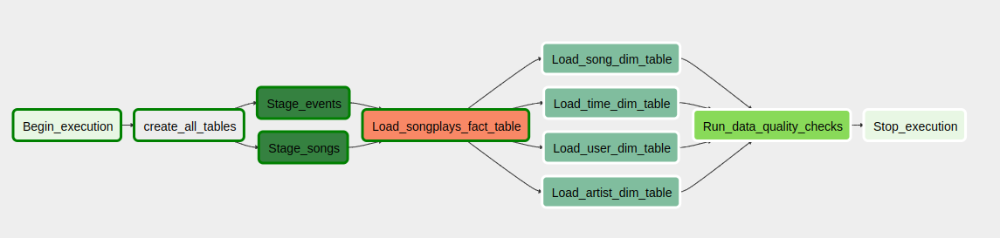

# Data-pipeline-nanodegree

This repo contains all files for the fifth project of "Data Engineering Nanodegree" course from Udacity. See the project description below.

# Summary

A music streaming startup called Sparkify wants to migrate its data to a cloud data warehouse.

The projects uses Apache Airflow to orchestrate the data pipeline.

This project aims to build an ETL on airflow capable of extracting data from S3, saving it in staging tables on Redshift and performing a transformation to provide an appropriate schema for the data analysis team. Also includes data quality checks.

# Output database schema

##  Staging tables

* staging_events: app user activity events.
* staging_songs: songs and artists metadata.

## Star schema

### Fact table

* **songplays**: records in log data associated with song plays.

### Dimension tabels

* **users**: app users info.
* **songs**: songs info.
* **artists**: artists info.
* **time**: timestamps of records in songplays broken down into specific time units (hour, day, week, month, year, weekday).

# ETL graph

